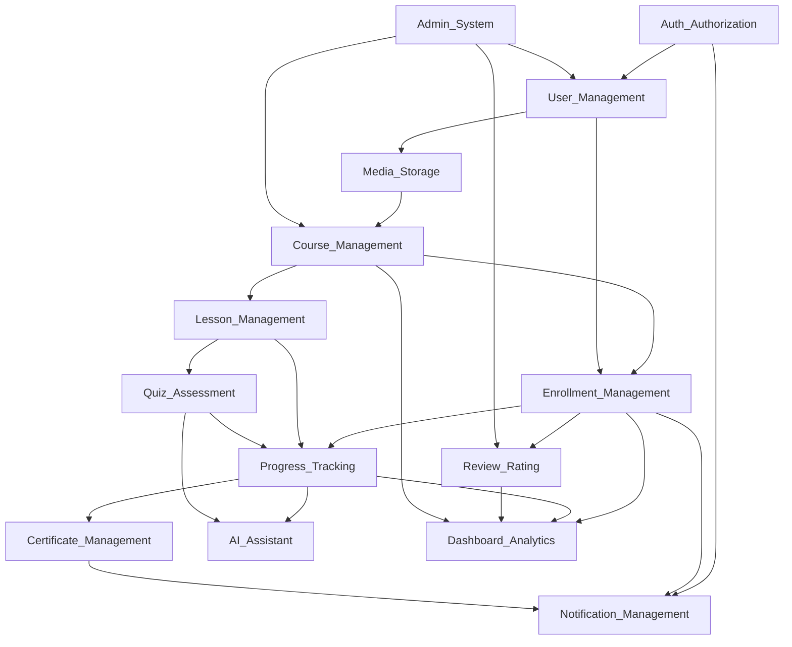
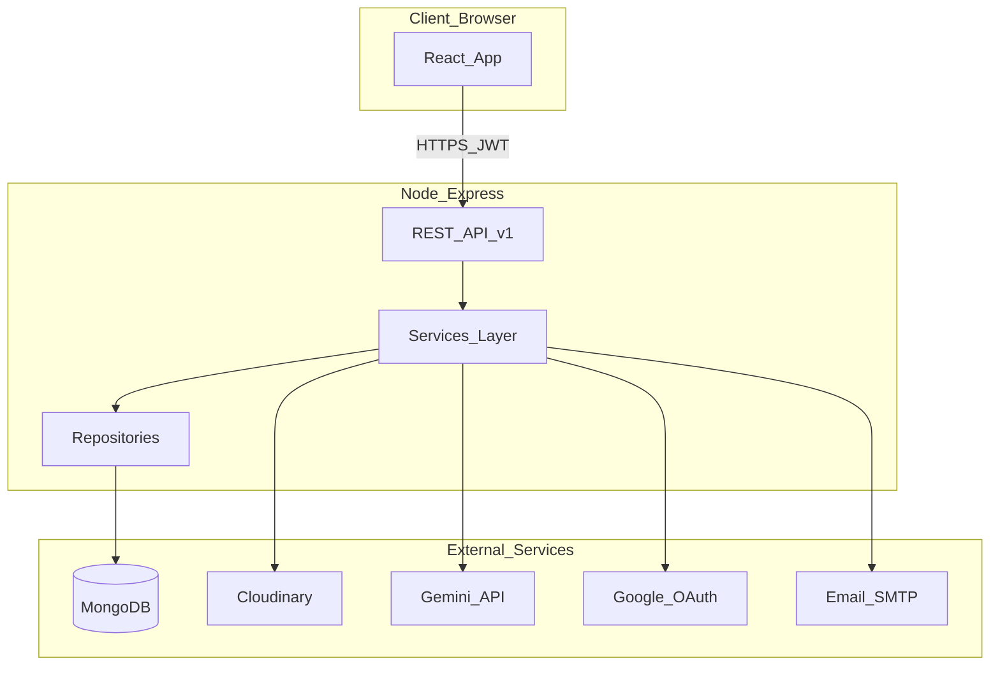

# 00 — Tổng quan hệ thống

## 1. Giới thiệu

**Online Language Learning Platform** là nền tảng học ngoại ngữ trực tuyến, cho phép:

- **Student** — duyệt khóa học, đăng ký, học bài, làm quiz, theo dõi tiến độ, nhận chứng chỉ, dùng AI trợ lý.
- **Teacher** — tạo khóa học/bài học/quiz, quản lý học viên, xem phân tích.
- **Admin** — duyệt giáo viên/khóa học, kiểm duyệt nội dung, cấu hình hệ thống, báo cáo.

Tài liệu này là **Software Design Document (SDD)** bám theo `SDD_Online_Language_Learning_Platform.docx`. Mục đích: định nghĩa kiến trúc và thiết kế đầy đủ **14 business modules** trước khi implement.

## 2. Technology Stack

| Layer | Công nghệ |
|-------|-----------|
| Frontend | React 19, Vite, Material UI, React Router DOM 7, Axios |
| Backend | Node.js, Express.js, Mongoose 8 |
| Database | MongoDB |
| Auth | JWT (access + refresh), bcrypt, Google OAuth, Email OTP |
| Media | Cloudinary |
| AI | Google Gemini API |
| Email | SMTP / SendGrid (transactional) |

**Kiến trúc:**

- Backend: **Clean Architecture + MVC** — `routes → controllers → services → repositories → models`
- Frontend: **Feature-Based Modular** — `routes → pages → services → api`

## 3. Vai trò (Roles)

| Role | Mô tả |
|------|-------|
| `student` | Người học; mặc định khi đăng ký công khai (BR-AUTH-010) |
| `teacher` | Giáo viên sau khi được Admin duyệt đơn ứng tuyển |
| `admin` | Quản trị viên nền tảng |

## 4. 14 Business Modules

| # | Module | Roles chính | Mô tả ngắn |
|---|--------|-------------|------------|
| 1 | Authentication & Authorization | All | Đăng ký, OTP, login, JWT, OAuth, RBAC |
| 2 | User Management | All | Profile, teacher application, account status |
| 3 | Course Management | Teacher, Admin, Student | CRUD khóa học, approval, publish, search |
| 4 | Lesson Management | Teacher, Admin, Student | Nội dung bài học, media, sequencing |
| 5 | Quiz & Assessment | Teacher, Student, Admin | Quiz, chấm điểm tự động/AI |
| 6 | Enrollment Management | Student, Admin | Đăng ký khóa, waitlist, hủy |
| 7 | Learning Progress Tracking | Student, Teacher, Admin | Tiến độ, streak, completion % |
| 8 | Review & Rating | Student, Teacher, Admin | Đánh giá khóa/giáo viên |
| 9 | Certificate Management | Student, Admin | Chứng chỉ hoàn thành |
| 10 | Notification Management | All | Email + in-app notifications |
| 11 | Media & File Storage | Teacher, Student, Admin | Cloudinary upload/transform |
| 12 | AI Learning Assistant | Student, Teacher | Gemini chat, grammar, grading |
| 13 | Dashboard & Analytics | All | KPI theo role |
| 14 | Admin & System Management | Admin | Moderation, taxonomy, audit |

## 5. Module Dependency Diagram

## 6. Kiến trúc tổng thể

## 7. Gap so với codebase hiện tại

Repo hiện tại (`learning_online` + `Backend`) là **prototype sớm**:

| Thành phần | Hiện có | Thiếu theo SDD |
|------------|---------|----------------|
| Models | `Course`, `Enrollment` | `User`, `Lesson`, `Quiz`, `Progress`, ... |
| Auth | bcrypt/jwt cài sẵn, chưa dùng | JWT flow, OTP, OAuth, RBAC middleware |
| Course | CRUD cơ bản | status lifecycle, CEFR, slug, approval |
| Enrollment | enroll, pin, unenroll | status machine, waitlist, expiration |
| Frontend | 4 routes, plain CSS | MUI, layouts theo role, AuthContext |
| Architecture | Controller → Model trực tiếp | Clean Architecture layers |
| Identity | `studentId` hardcode | JWT-derived user context |

**Chiến lược migration:** Giữ logic Course/Enrollment hiện có, refactor dần theo roadmap §07 khi implement.

## 8. Phạm vi & giới hạn

**Trong phạm vi thiết kế:**

- 14 modules đầy đủ theo SDD
- REST API `/api/v1`
- Business rules (BR-*) và functional requirements (FR-*)

**Ngoài phạm vi:**

- Payment gateway thực (Stripe/PayPal) — chỉ mô hình trạng thái `pending → active`
- Mobile native app
- Real-time video conferencing

## 9. Tài liệu liên quan

| File | Nội dung |
|------|----------|
| [01-architecture.md](./01-architecture.md) | Clean Architecture, dependency rules, integrations |
| [02-folder-structure.md](./02-folder-structure.md) | Cây thư mục FE/BE target |
| [03-data-model.md](./03-data-model.md) | ERD, schemas MongoDB |
| [04-api-design.md](./04-api-design.md) | REST endpoints |
| [05-flows-and-rules.md](./05-flows-and-rules.md) | Sequence diagrams, business rules |
| [06-ui-route-map.md](./06-ui-route-map.md) | Routes, layouts, guards |
| [07-implementation-roadmap.md](./07-implementation-roadmap.md) | Thứ tự triển khai 14 bước |
