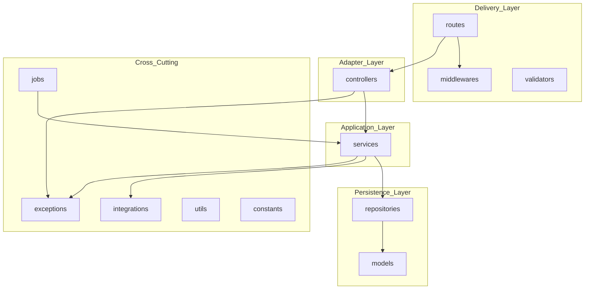
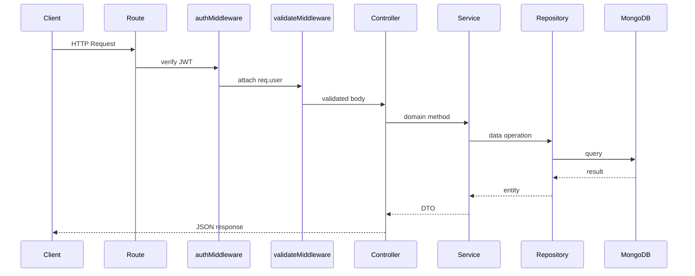
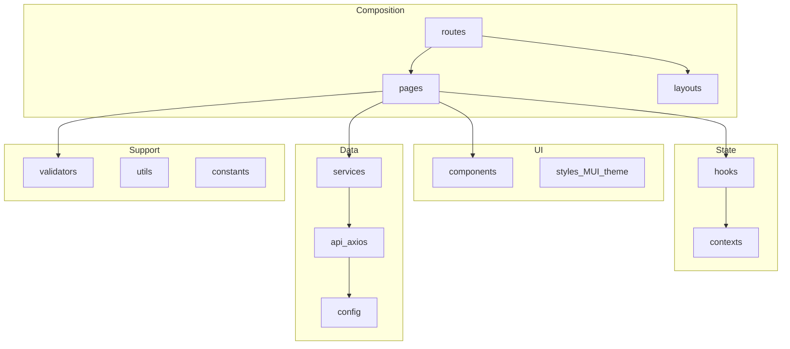
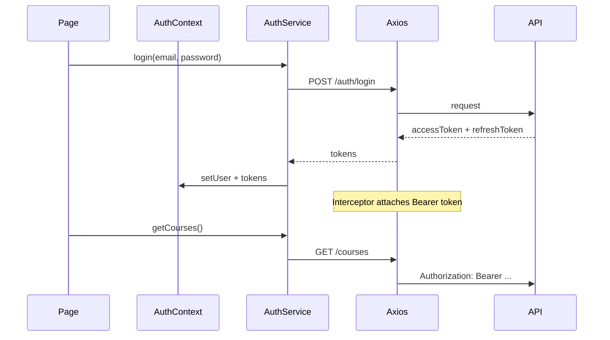
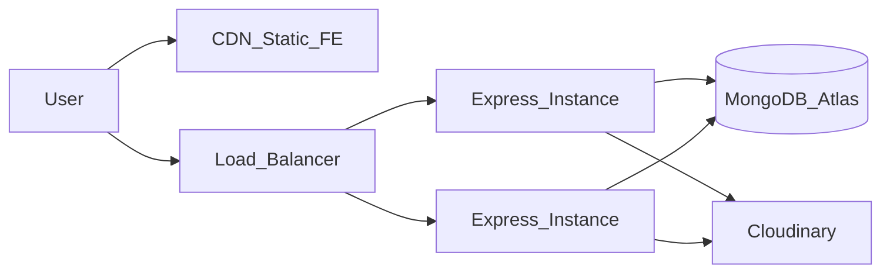

# 01 — Kiến trúc hệ thống

## 1. Nguyên tắc thiết kế

1. **Separation of concerns** — HTTP, business logic, persistence tách biệt.
2. **Dependency inversion** — Business layer không phụ thuộc Express hay Mongoose API trực tiếp.
3. **Single responsibility** — Mỗi service xử lý một domain module.
4. **Fail fast** — Validation ở middleware trước khi vào controller.
5. **Security by default** — Mọi endpoint (trừ public catalog/auth) yêu cầu JWT + role guard.

## 2. Backend — Clean Architecture + MVC

### 2.1 Layer diagram



### 2.2 Trách nhiệm từng layer

| Layer | Trách nhiệm | Không được làm |
|-------|-------------|----------------|
| **routes** | Map URL → controller; gắn middleware auth/validate | Business logic |
| **controllers** | Parse req/res, status code, delegate service | Gọi repository/model trực tiếp |
| **services** | Business rules (BR-*), orchestrate workflows | Biết HTTP req/res |
| **repositories** | CRUD, query, pagination | Business validation |
| **models** | Schema, indexes, virtuals | Gọi external API |
| **integrations** | Cloudinary, Gemini, OAuth, Email adapters | Được gọi từ controllers |
| **middlewares** | JWT verify, role guard, rate limit, error handler | Domain logic |
| **jobs** | Scheduled tasks (expire enrollment, orphan cleanup) | Duplicate logic khác services |

### 2.3 Dependency rule

```
models ← repositories ← services ← controllers ← routes
                              ↑
                        integrations
```

- Controllers **chỉ** gọi services.
- Services **chỉ** gọi repositories và integrations.
- Integrations **không** được import từ controllers.

### 2.4 Request lifecycle



### 2.5 Error handling

Custom exceptions trong `exceptions/`:

| Class | HTTP Status | Khi nào |
|-------|-------------|---------|
| `ValidationError` | 400 | Input không hợp lệ |
| `UnauthorizedError` | 401 | Token thiếu/hết hạn |
| `ForbiddenError` | 403 | Role/ownership không đủ |
| `NotFoundError` | 404 | Entity không tồn tại |
| `ConflictError` | 409 | Duplicate enrollment, email |
| `AppError` | 500 | Lỗi không mong đợi |

`middlewares/errorHandler.js` map exception → JSON:

```json
{
  "success": false,
  "error": {
    "code": "COURSE_NOT_FOUND",
    "message": "Course not found"
  }
}
```

## 3. Frontend — Feature-Based Modular

### 3.1 Layer diagram



### 3.2 Dependency rule (Frontend)

```
config, constants (base)
    ↑
api, utils, assets, styles
    ↑
services
    ↑
contexts, hooks, validators
    ↑
components
    ↑
layouts
    ↑
pages
    ↑
routes (top — chỉ consumed by App.jsx)
```

- **Pages không import api trực tiếp** — luôn qua services.
- **Components không import pages** — giữ reusable.

### 3.3 Auth state flow



**Token storage:** `accessToken` in memory (AuthContext); `refreshToken` in httpOnly cookie hoặc secure localStorage (design choice: httpOnly cookie preferred).

**Axios interceptor:** On 401 → call `/auth/refresh` → retry original request; on refresh fail → logout redirect.

## 4. External Integrations

### 4.1 Cloudinary (Media)

| Concern | Design |
|---------|--------|
| Upload flow | Client requests signed upload params → direct upload to Cloudinary → callback saves `MediaAsset` |
| Transform | Thumbnail URL via Cloudinary transformation params |
| Delete | Service validates ownership → `cloudinaryClient.destroy(publicId)` |
| Orphan cleanup | `jobs/cleanupOrphanAssets.job.js` — nightly scan |

**File:** `integrations/cloudinaryClient.js`

### 4.2 Google Gemini (AI)

| Use case | Trigger |
|----------|---------|
| Conversation practice | Student starts AI session |
| Grammar correction | Student submits text |
| Quiz grading | Open-ended/speaking answers post-submit |
| Study recommendations | Progress milestone |

**Quota:** `User.aiQuotaUsed` / `aiQuotaLimit` per period; enforce in `aiService` (BR-AI-006 graceful degradation).

**File:** `integrations/geminiClient.js`

### 4.3 Google OAuth

| Step | Action |
|------|--------|
| 1 | Frontend redirects to Google consent |
| 2 | Callback hits `POST /api/v1/auth/google` with code |
| 3 | Backend exchanges code, matches email (BR-AUTH-009) |
| 4 | Issue JWT pair |

**File:** `integrations/googleOAuthClient.js`

### 4.4 Email (SMTP/SendGrid)

Transactional emails:

- OTP verification (FR-AUTH-002)
- Password reset (FR-AUTH-008)
- Enrollment confirmation (FR-ENROLL-001)
- Certificate issued (FR-CERT-003)
- Review received (FR-REVIEW-005)
- Admin broadcast (FR-NOTIF-006)

**File:** `integrations/emailClient.js`

## 5. Security Architecture

| Concern | Implementation |
|---------|----------------|
| Password | bcrypt, min 8 chars + uppercase + number + symbol (BR-AUTH-002) |
| JWT Access | 15 min TTL (BR-AUTH-008) |
| JWT Refresh | Rotation, single-use (BR-AUTH-007) |
| OTP | 6 digits, 5 min expiry, max 5 attempts (BR-AUTH-003/004) |
| Login lockout | 5 fails → 15 min lock (BR-AUTH-006) |
| RBAC | `roleGuard(['teacher', 'admin'])` middleware |
| Rate limiting | Auth endpoints: 10 req/min/IP |
| CORS | Whitelist frontend origin from env |

## 6. API Versioning & Conventions

- Base path: `/api/v1`
- Response envelope:

```json
{
  "success": true,
  "data": { },
  "meta": { "page": 1, "limit": 20, "total": 100 }
}
```

- Pagination query: `?page=1&limit=20&sort=-createdAt`
- Filtering: `?language=English&cefrLevel=A1&status=published`

## 7. Background Jobs

| Job | Schedule | Module |
|-----|----------|--------|
| `expireEnrollments.job.js` | Daily 00:00 UTC | Enrollment |
| `cleanupOrphanAssets.job.js` | Weekly | Media |
| `refreshDashboardKpis.job.js` | Hourly | Dashboard |
| `notificationRetention.job.js` | Monthly | Notification |

Jobs gọi **services** — không duplicate business logic.

## 8. Logging & Audit

- **App logs:** Winston/Pino → `logs/app.log`
- **Audit logs:** Admin actions → `AuditLog` collection + `logs/audit.log`
- Events: user suspend, course approve/reject, certificate revoke, config change

## 9. Environment Variables

### Backend (`Backend/.env`)

```
NODE_ENV=development
PORT=9999
MONGO_URI=mongodb://localhost:27017/language_learning
JWT_ACCESS_SECRET=
JWT_REFRESH_SECRET=
JWT_ACCESS_EXPIRES=15m
JWT_REFRESH_EXPIRES=7d
GOOGLE_CLIENT_ID=
GOOGLE_CLIENT_SECRET=
GOOGLE_CALLBACK_URL=
CLOUDINARY_CLOUD_NAME=
CLOUDINARY_API_KEY=
CLOUDINARY_API_SECRET=
GEMINI_API_KEY=
SMTP_HOST=
SMTP_PORT=
SMTP_USER=
SMTP_PASS=
EMAIL_FROM=
FRONTEND_URL=http://localhost:5173
```

### Frontend (`learning_online/.env`)

```
VITE_API_BASE_URL=http://localhost:9999/api/v1
VITE_GOOGLE_CLIENT_ID=
```

## 10. Deployment Topology (reference)



Frontend: Vite build → static hosting (Vercel/Netlify).
Backend: Node process (PM2/Docker) behind reverse proxy.
