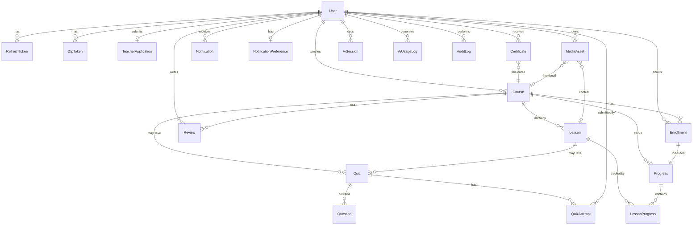

# 03 — Data Model

## 1. Entity Relationship Diagram



## 2. Shared Enums

```javascript
// constants/roles.js
ROLES = ['student', 'teacher', 'admin']

// constants/courseStatus.js
COURSE_STATUS = ['draft', 'pending_approval', 'approved', 'published', 'rejected', 'archived']

// constants/enrollmentStatus.js
ENROLLMENT_STATUS = ['pending', 'active', 'completed', 'cancelled', 'expired', 'waitlisted']

// constants/lessonStatus.js
LESSON_STATUS = ['draft', 'published']

// constants/questionTypes.js
QUESTION_TYPES = ['multiple_choice', 'fill_blank', 'listening', 'speaking', 'matching', 'open_ended']

// constants/userStatus.js
USER_STATUS = ['active', 'suspended', 'banned', 'deleted']

// constants/cefrLevels.js
CEFR_LEVELS = ['A1', 'A2', 'B1', 'B2', 'C1', 'C2']

// constants/languages.js
LANGUAGES = ['English', 'Vietnamese', 'French', 'Spanish', 'Chinese', 'Japanese', 'Korean']

// constants/notificationTypes.js
NOTIFICATION_TYPES = ['otp', 'password_reset', 'enrollment', 'certificate', 'review', 'announcement', 'course_approval', 'teacher_approval']

// constants/aiSessionTypes.js
AI_SESSION_TYPES = ['conversation', 'grammar', 'grading', 'recommendation']
```

---

## 3. Collection Schemas

### 3.1 User

| Field | Type | Required | Index | Notes |
|-------|------|----------|-------|-------|
| `_id` | ObjectId | auto | PK | |
| `email` | String | yes | unique | Lowercase, trimmed |
| `passwordHash` | String | conditional | — | Null if OAuth-only |
| `fullName` | String | yes | — | |
| `role` | String | yes | index | enum ROLES; default `student` |
| `avatar` | String | no | — | Cloudinary URL |
| `bio` | String | no | — | Max 500 chars |
| `targetLanguages` | [String] | no | — | Languages user wants to learn |
| `nativeLanguage` | String | no | — | |
| `timezone` | String | no | — | IANA timezone |
| `googleId` | String | no | sparse unique | OAuth link |
| `isEmailVerified` | Boolean | yes | — | default false |
| `status` | String | yes | index | enum USER_STATUS; default `active` |
| `failedLoginCount` | Number | yes | — | default 0 |
| `lockUntil` | Date | no | — | Account lock expiry |
| `aiQuotaLimit` | Number | yes | — | default 50/month |
| `aiQuotaUsed` | Number | yes | — | default 0 |
| `aiQuotaResetAt` | Date | no | — | Monthly reset |
| `teacherRating` | Number | no | — | Aggregated 1-5 |
| `teacherRatingCount` | Number | no | — | default 0 |
| `createdAt` | Date | auto | — | |
| `updatedAt` | Date | auto | — | |

**Indexes:** `{ email: 1 }` unique, `{ role: 1, status: 1 }`, `{ googleId: 1 }` sparse

---

### 3.2 RefreshToken

| Field | Type | Required | Index | Notes |
|-------|------|----------|-------|-------|
| `_id` | ObjectId | auto | PK | |
| `userId` | ObjectId | yes | index | ref User |
| `token` | String | yes | unique | Hashed refresh token |
| `expiresAt` | Date | yes | TTL | 7 days |
| `isRevoked` | Boolean | yes | — | default false |
| `createdAt` | Date | auto | — | |

**Indexes:** `{ token: 1 }` unique, `{ expiresAt: 1 }` TTL, `{ userId: 1 }`

---

### 3.3 OtpToken

| Field | Type | Required | Index | Notes |
|-------|------|----------|-------|-------|
| `_id` | ObjectId | auto | PK | |
| `userId` | ObjectId | yes | index | ref User |
| `code` | String | yes | — | Hashed 6-digit OTP |
| `type` | String | yes | — | `email_verify` \| `password_reset` |
| `attempts` | Number | yes | — | default 0; max 5 |
| `expiresAt` | Date | yes | TTL | 5 minutes |
| `isUsed` | Boolean | yes | — | default false |
| `createdAt` | Date | auto | — | |

**Indexes:** `{ userId: 1, type: 1 }`, `{ expiresAt: 1 }` TTL

---

### 3.4 TeacherApplication

| Field | Type | Required | Index | Notes |
|-------|------|----------|-------|-------|
| `_id` | ObjectId | auto | PK | |
| `userId` | ObjectId | yes | unique | ref User |
| `credentials` | String | yes | — | Qualifications text |
| `documentAssetIds` | [ObjectId] | no | — | ref MediaAsset |
| `languagesTaught` | [String] | yes | — | |
| `status` | String | yes | index | `pending` \| `approved` \| `rejected` |
| `adminFeedback` | String | no | — | Required on reject |
| `reviewedBy` | ObjectId | no | — | ref User (admin) |
| `reviewedAt` | Date | no | — | |
| `createdAt` | Date | auto | — | |
| `updatedAt` | Date | auto | — | |

---

### 3.5 Course

| Field | Type | Required | Index | Notes |
|-------|------|----------|-------|-------|
| `_id` | ObjectId | auto | PK | |
| `title` | String | yes | text | |
| `slug` | String | yes | unique | URL-friendly (BR-COURSE-009) |
| `description` | String | yes | text | |
| `language` | String | yes | index | enum LANGUAGES |
| `cefrLevel` | String | yes | index | enum CEFR_LEVELS |
| `category` | String | yes | index | From SystemConfig |
| `price` | Number | yes | — | >= 0 (BR-COURSE-006) |
| `thumbnailAssetId` | ObjectId | no | — | ref MediaAsset |
| `teacherId` | ObjectId | yes | index | ref User |
| `status` | String | yes | index | enum COURSE_STATUS; default `draft` |
| `rejectionReason` | String | no | — | Admin feedback |
| `capacity` | Number | no | — | null = unlimited |
| `durationDays` | Number | no | — | Enrollment time-box |
| `isSequential` | Boolean | yes | — | Lesson lock default true |
| `lessonCount` | Number | yes | — | Denormalized; default 0 |
| `averageRating` | Number | no | — | Denormalized 1-5 |
| `reviewCount` | Number | no | — | default 0 |
| `enrollmentCount` | Number | no | — | default 0 |
| `publishedAt` | Date | no | — | |
| `createdAt` | Date | auto | — | |
| `updatedAt` | Date | auto | — | |

**Indexes:** `{ slug: 1 }` unique, `{ status: 1, language: 1, cefrLevel: 1 }`, `{ title: 'text', description: 'text' }`

**Migration từ hiện tại:** Thêm `slug`, `cefrLevel`, `category`, `status`, `thumbnailAssetId`; rename `image` → deprecated, migrate to MediaAsset.

---

### 3.6 Lesson

| Field | Type | Required | Index | Notes |
|-------|------|----------|-------|-------|
| `_id` | ObjectId | auto | PK | |
| `courseId` | ObjectId | yes | index | ref Course |
| `title` | String | yes | — | |
| `description` | String | no | — | |
| `order` | Number | yes | — | Sequence within course |
| `contentType` | [String] | yes | — | `video`, `audio`, `text`, `vocabulary`, `grammar` |
| `videoAssetId` | ObjectId | no | — | ref MediaAsset |
| `audioAssetId` | ObjectId | no | — | ref MediaAsset |
| `textContent` | String | no | — | Rich text / markdown |
| `vocabulary` | [{ word, translation, pronunciation }] | no | — | Embedded array |
| `grammarNotes` | String | no | — | |
| `resourceAssetIds` | [ObjectId] | no | — | PDFs, etc. |
| `estimatedMinutes` | Number | no | — | |
| `status` | String | yes | — | enum LESSON_STATUS; default `draft` |
| `createdAt` | Date | auto | — | |
| `updatedAt` | Date | auto | — | |

**Indexes:** `{ courseId: 1, order: 1 }` unique

---

### 3.7 Quiz

| Field | Type | Required | Index | Notes |
|-------|------|----------|-------|-------|
| `_id` | ObjectId | auto | PK | |
| `title` | String | yes | — | |
| `courseId` | ObjectId | yes | index | ref Course |
| `lessonId` | ObjectId | no | index | ref Lesson (optional attach) |
| `teacherId` | ObjectId | yes | — | ref User |
| `timeLimitMinutes` | Number | no | — | null = no limit |
| `maxAttempts` | Number | yes | — | default 3 |
| `passingScore` | Number | yes | — | Percentage 0-100 |
| `isRandomized` | Boolean | yes | — | default false |
| `status` | String | yes | — | `draft` \| `published` |
| `createdAt` | Date | auto | — | |
| `updatedAt` | Date | auto | — | |

---

### 3.8 Question

| Field | Type | Required | Index | Notes |
|-------|------|----------|-------|-------|
| `_id` | ObjectId | auto | PK | |
| `quizId` | ObjectId | yes | index | ref Quiz |
| `type` | String | yes | — | enum QUESTION_TYPES |
| `prompt` | String | yes | — | Question text |
| `options` | [{ id, text }] | conditional | — | For MCQ/matching |
| `correctAnswer` | Mixed | conditional | — | String or array |
| `audioAssetId` | ObjectId | no | — | For listening |
| `points` | Number | yes | — | default 1 |
| `order` | Number | yes | — | |
| `explanation` | String | no | — | Shown after grading |

**Indexes:** `{ quizId: 1, order: 1 }`

---

### 3.9 QuizAttempt

| Field | Type | Required | Index | Notes |
|-------|------|----------|-------|-------|
| `_id` | ObjectId | auto | PK | |
| `quizId` | ObjectId | yes | index | ref Quiz |
| `studentId` | ObjectId | yes | index | ref User |
| `answers` | [{ questionId, value, audioAssetId }] | yes | — | |
| `score` | Number | no | — | Percentage after grading |
| `isPassed` | Boolean | no | — | |
| `gradingStatus` | String | yes | — | `pending` \| `auto_graded` \| `ai_graded` \| `manual` |
| `feedback` | [{ questionId, comment, score }] | no | — | |
| `startedAt` | Date | yes | — | |
| `submittedAt` | Date | no | — | |
| `timeSpentSeconds` | Number | no | — | |

**Indexes:** `{ quizId: 1, studentId: 1 }`, `{ studentId: 1, submittedAt: -1 }`

---

### 3.10 Enrollment

| Field | Type | Required | Index | Notes |
|-------|------|----------|-------|-------|
| `_id` | ObjectId | auto | PK | |
| `studentId` | ObjectId | yes | index | ref User |
| `courseId` | ObjectId | yes | index | ref Course |
| `status` | String | yes | index | enum ENROLLMENT_STATUS |
| `isPinned` | Boolean | yes | — | default false (giữ từ hiện tại) |
| `enrolledAt` | Date | auto | — | |
| `expiresAt` | Date | no | — | Time-boxed courses |
| `completedAt` | Date | no | — | |
| `cancelledAt` | Date | no | — | |
| `paymentStatus` | String | no | — | `free` \| `pending` \| `confirmed` |

**Indexes:** `{ studentId: 1, courseId: 1 }` unique (giữ từ hiện tại), `{ status: 1, expiresAt: 1 }`

**Migration:** Thêm `status` (default `active` cho records cũ), `expiresAt`, `paymentStatus`.

---

### 3.11 Progress

| Field | Type | Required | Index | Notes |
|-------|------|----------|-------|-------|
| `_id` | ObjectId | auto | PK | |
| `studentId` | ObjectId | yes | index | ref User |
| `courseId` | ObjectId | yes | index | ref Course |
| `enrollmentId` | ObjectId | yes | unique | ref Enrollment |
| `completionPercent` | Number | yes | — | 0-100 |
| `lessonsCompleted` | Number | yes | — | default 0 |
| `totalLessons` | Number | yes | — | Snapshot at enrollment |
| `quizzesPassed` | Number | yes | — | default 0 |
| `studyTimeMinutes` | Number | yes | — | default 0 |
| `currentStreak` | Number | yes | — | default 0 |
| `longestStreak` | Number | yes | — | default 0 |
| `lastStudiedAt` | Date | no | — | |
| `milestones` | [String] | no | — | e.g. `50_percent`, `100_percent` |
| `createdAt` | Date | auto | — | |
| `updatedAt` | Date | auto | — | |

**Indexes:** `{ enrollmentId: 1 }` unique, `{ studentId: 1, courseId: 1 }`

---

### 3.12 LessonProgress

| Field | Type | Required | Index | Notes |
|-------|------|----------|-------|-------|
| `_id` | ObjectId | auto | PK | |
| `progressId` | ObjectId | yes | index | ref Progress |
| `lessonId` | ObjectId | yes | index | ref Lesson |
| `isCompleted` | Boolean | yes | — | default false |
| `completedAt` | Date | no | — | |
| `timeSpentMinutes` | Number | yes | — | default 0 |

**Indexes:** `{ progressId: 1, lessonId: 1 }` unique

---

### 3.13 Review

| Field | Type | Required | Index | Notes |
|-------|------|----------|-------|-------|
| `_id` | ObjectId | auto | PK | |
| `courseId` | ObjectId | yes | index | ref Course |
| `studentId` | ObjectId | yes | index | ref User |
| `rating` | Number | yes | — | 1-5 integer |
| `comment` | String | no | — | Max 1000 chars |
| `isFlagged` | Boolean | yes | — | default false |
| `isRemoved` | Boolean | yes | — | default false (admin moderation) |
| `createdAt` | Date | auto | — | |
| `updatedAt` | Date | auto | — | |

**Indexes:** `{ courseId: 1, studentId: 1 }` unique (one review per student per course)

---

### 3.14 Certificate

| Field | Type | Required | Index | Notes |
|-------|------|----------|-------|-------|
| `_id` | ObjectId | auto | PK | |
| `serialNumber` | String | yes | unique | e.g. `CERT-2026-XXXXXX` |
| `studentId` | ObjectId | yes | index | ref User |
| `courseId` | ObjectId | yes | index | ref Course |
| `progressId` | ObjectId | yes | — | ref Progress |
| `pdfAssetId` | ObjectId | yes | — | ref MediaAsset |
| `issuedAt` | Date | auto | — | |
| `isRevoked` | Boolean | yes | — | default false |
| `revokedAt` | Date | no | — | |
| `revokedReason` | String | no | — | |

**Indexes:** `{ serialNumber: 1 }` unique, `{ studentId: 1 }`

---

### 3.15 Notification

| Field | Type | Required | Index | Notes |
|-------|------|----------|-------|-------|
| `_id` | ObjectId | auto | PK | |
| `userId` | ObjectId | yes | index | ref User |
| `type` | String | yes | — | enum NOTIFICATION_TYPES |
| `title` | String | yes | — | |
| `body` | String | yes | — | |
| `isRead` | Boolean | yes | — | default false |
| `metadata` | Object | no | — | Related entity IDs |
| `createdAt` | Date | auto | — | |

**Indexes:** `{ userId: 1, isRead: 1, createdAt: -1 }`

---

### 3.16 NotificationPreference

| Field | Type | Required | Index | Notes |
|-------|------|----------|-------|-------|
| `_id` | ObjectId | auto | PK | |
| `userId` | ObjectId | yes | unique | ref User |
| `emailEnabled` | Boolean | yes | — | default true |
| `inAppEnabled` | Boolean | yes | — | default true |
| `disabledCategories` | [String] | no | — | Opt-out per type |

---

### 3.17 MediaAsset

| Field | Type | Required | Index | Notes |
|-------|------|----------|-------|-------|
| `_id` | ObjectId | auto | PK | |
| `ownerId` | ObjectId | yes | index | ref User |
| `publicId` | String | yes | unique | Cloudinary public ID |
| `url` | String | yes | — | Delivery URL |
| `type` | String | yes | — | `image` \| `video` \| `audio` \| `pdf` \| `raw` |
| `mimeType` | String | no | — | |
| `sizeBytes` | Number | no | — | |
| `width` | Number | no | — | |
| `height` | Number | no | — | |
| `durationSeconds` | Number | no | — | Video/audio |
| `isOrphan` | Boolean | yes | — | default false |
| `createdAt` | Date | auto | — | |

**Indexes:** `{ publicId: 1 }` unique, `{ ownerId: 1 }`, `{ isOrphan: 1 }`

---

### 3.18 AiSession

| Field | Type | Required | Index | Notes |
|-------|------|----------|-------|-------|
| `_id` | ObjectId | auto | PK | |
| `userId` | ObjectId | yes | index | ref User |
| `type` | String | yes | — | enum AI_SESSION_TYPES |
| `targetLanguage` | String | no | — | |
| `messages` | [{ role, content, timestamp }] | yes | — | Chat history |
| `metadata` | Object | no | — | quizId, lessonId, etc. |
| `createdAt` | Date | auto | — | |
| `updatedAt` | Date | auto | — | |

---

### 3.19 AiUsageLog

| Field | Type | Required | Index | Notes |
|-------|------|----------|-------|-------|
| `_id` | ObjectId | auto | PK | |
| `userId` | ObjectId | yes | index | ref User |
| `sessionId` | ObjectId | no | — | ref AiSession |
| `type` | String | yes | — | enum AI_SESSION_TYPES |
| `tokensUsed` | Number | no | — | |
| `createdAt` | Date | auto | — | |

**Indexes:** `{ userId: 1, createdAt: -1 }`

---

### 3.20 SystemConfig

| Field | Type | Required | Index | Notes |
|-------|------|----------|-------|-------|
| `_id` | ObjectId | auto | PK | |
| `key` | String | yes | unique | e.g. `categories`, `cefr_levels` |
| `value` | Mixed | yes | — | Array or object |
| `updatedBy` | ObjectId | no | — | ref User (admin) |
| `updatedAt` | Date | auto | — | |

**Seed data:**

```json
{ "key": "categories", "value": ["General", "Business", "Travel", "Academic", "Conversation"] }
{ "key": "cefr_levels", "value": ["A1", "A2", "B1", "B2", "C1", "C2"] }
```

---

### 3.21 AuditLog

| Field | Type | Required | Index | Notes |
|-------|------|----------|-------|-------|
| `_id` | ObjectId | auto | PK | |
| `actorId` | ObjectId | yes | index | ref User |
| `action` | String | yes | — | e.g. `course.approve`, `user.suspend` |
| `targetType` | String | yes | — | `User`, `Course`, etc. |
| `targetId` | ObjectId | yes | — | |
| `details` | Object | no | — | Before/after snapshot |
| `ipAddress` | String | no | — | |
| `createdAt` | Date | auto | — | |

**Indexes:** `{ actorId: 1, createdAt: -1 }`, `{ targetType: 1, targetId: 1 }`

---

## 4. Denormalization Strategy

| Field | Collection | Source | Update trigger |
|-------|------------|--------|----------------|
| `Course.lessonCount` | Course | Count lessons | Lesson create/delete |
| `Course.averageRating` | Course | Avg reviews | Review create/update/delete |
| `Course.enrollmentCount` | Course | Count enrollments | Enrollment create/cancel |
| `User.teacherRating` | User | Avg course reviews for teacher's courses | Review change |
| `Progress.completionPercent` | Progress | lessonsCompleted / totalLessons | LessonProgress complete |

## 5. Data Integrity Rules

| Rule | Enforcement |
|------|-------------|
| Unique email | User schema unique index |
| Unique enrollment per student+course | Enrollment compound unique index |
| Unique review per student+course | Review compound unique index |
| Course slug unique | Course schema unique index |
| OTP single-use | `isUsed` flag check in authService |
| Refresh token rotation | Revoke old on refresh |
| Cascade on course archive | Enrollments remain; new enrollments blocked |
| Orphan media cleanup | Job scans `isOrphan: true` older than 7 days |

## 6. Sample Document Relationships

```
User (teacher)
  └── Course (published)
        ├── Lesson (order: 1, 2, 3)
        │     └── Quiz (lesson-level)
        ├── Quiz (course-level final exam)
        └── Review[]

User (student)
  └── Enrollment (active)
        └── Progress
              └── LessonProgress[] (per lesson)
        └── QuizAttempt[]
        └── Certificate (on 100% + pass final quiz)
```
