# 05 — Flows & Business Rules

## 1. Authentication Flows

### 1.1 Registration + OTP Verification

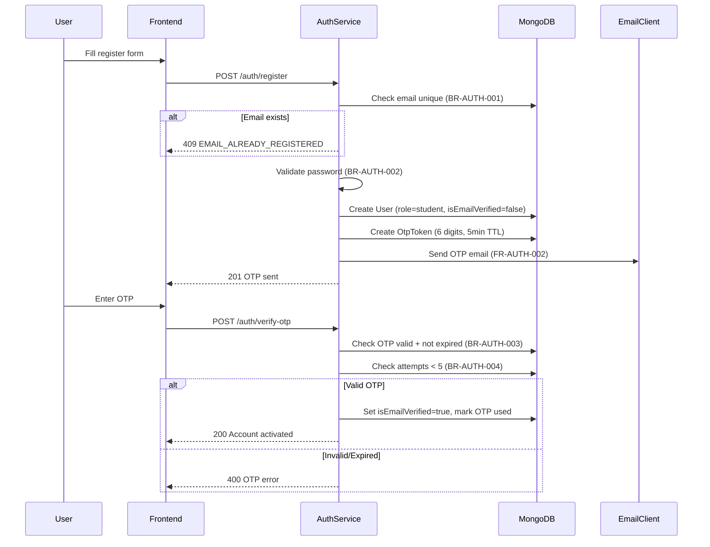

### 1.2 Login + Token Refresh

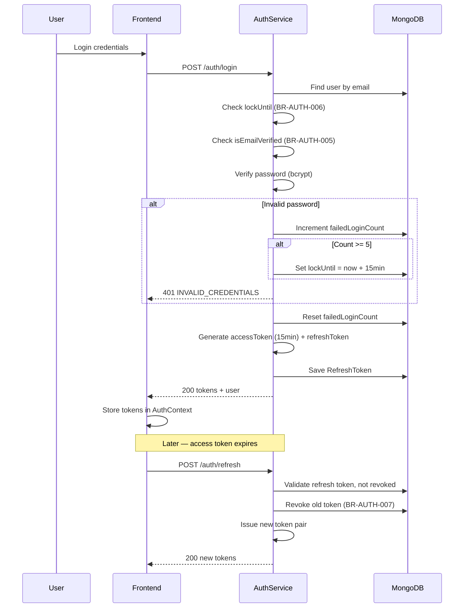

### 1.3 Google OAuth

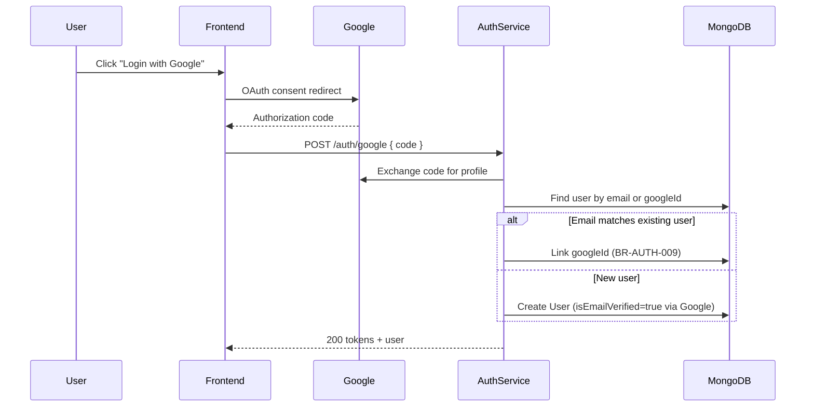

### 1.4 Auth Business Rules Summary

| Rule ID | Name | Condition | Expected Result | Error |
|---------|------|-----------|-------------------|-------|
| BR-AUTH-001 | Unique Email | Registration | Email not in DB | "Email already registered" |
| BR-AUTH-002 | Password Strength | Register/reset | Min 8, 1 upper, 1 num, 1 symbol | "Password does not meet requirements" |
| BR-AUTH-003 | OTP Expiration | Verify | Within 5 minutes | "OTP has expired" |
| BR-AUTH-004 | OTP Attempt Limit | Verify | Max 5 attempts | "Too many attempts" |
| BR-AUTH-005 | Verified to Login | Login | isEmailVerified=true | "Please verify your email" |
| BR-AUTH-006 | Failed Login Lockout | Login | 5 fails → lock 15min | "Account temporarily locked" |
| BR-AUTH-007 | Refresh Token Rotation | Refresh | Old token single-use | "Invalid refresh token" |
| BR-AUTH-008 | Access Token TTL | Issue | 15 minutes | "Access token expired" |
| BR-AUTH-009 | OAuth Account Linking | OAuth | Match by verified email | "Account linking failed" |
| BR-AUTH-010 | Role on Registration | Register | role=student only | "Invalid role selection" |
| BR-AUTH-011 | Reset Token Single Use | Reset | Mark used after success | "Reset link already used" |
| BR-AUTH-012 | Logout Invalidates Session | Logout | Revoke refresh token | "Session terminated" |

---

## 2. Teacher Application Flow

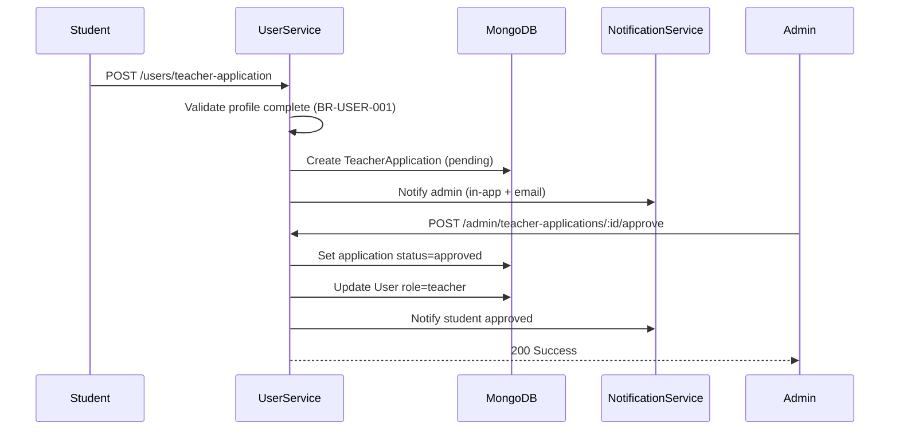

| Rule ID | Name | Condition | Expected Result |
|---------|------|-----------|-------------------|
| BR-USER-001 | Profile Completeness | Teacher application | fullName, bio, avatar required |
| BR-USER-002 | One Application Per User | Submit | Only one pending/approved application |
| BR-USER-003 | Rejection Requires Feedback | Admin reject | adminFeedback not empty |

---

## 3. Course Lifecycle Flow

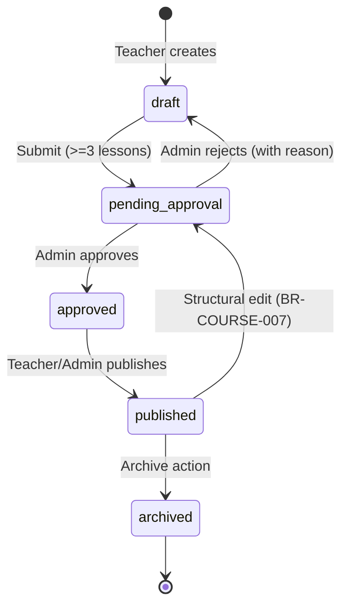

### 3.1 Course Approval Sequence

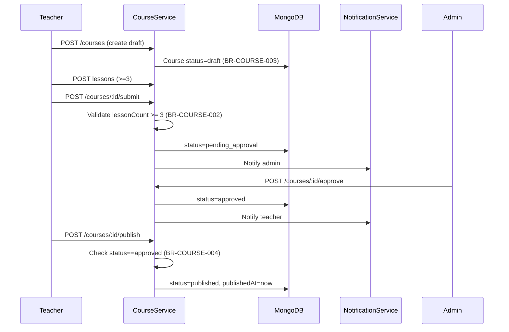

### 3.2 Course Business Rules Summary

| Rule ID | Name | Condition | Expected Result | Error |
|---------|------|-----------|-------------------|-------|
| BR-COURSE-001 | Owner Only Edits | Edit | requester==teacherId or Admin | "No permission" |
| BR-COURSE-002 | Min 3 Lessons to Submit | Submit | lessonCount >= 3 | "Must contain 3 lessons" |
| BR-COURSE-003 | Draft on Creation | Create | status=draft | N/A |
| BR-COURSE-004 | Approval Required to Publish | Publish | status==approved | "Must be approved" |
| BR-COURSE-005 | Rejection Requires Feedback | Reject | rejectionReason not empty | "Reason required" |
| BR-COURSE-006 | Price >= 0 | Create/edit | price >= 0 | "Price must be zero or greater" |
| BR-COURSE-007 | Structural Lock on Published | Edit published | language/cefr change → re-approval | "Requires re-approval" |
| BR-COURSE-008 | Archive Preserves Data | Archive | status=archived, hidden from catalog | N/A |
| BR-COURSE-009 | Unique Slug | Create | slug unique | "Slug already exists" |

---

## 4. Enrollment → Progress Flow

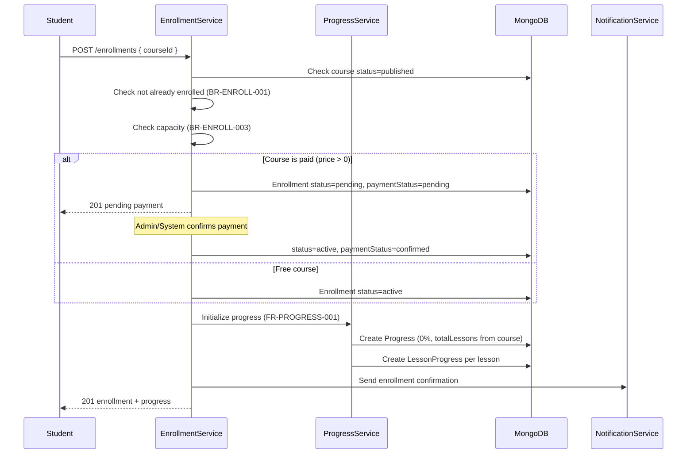

### 4.1 Lesson Completion + Sequential Lock

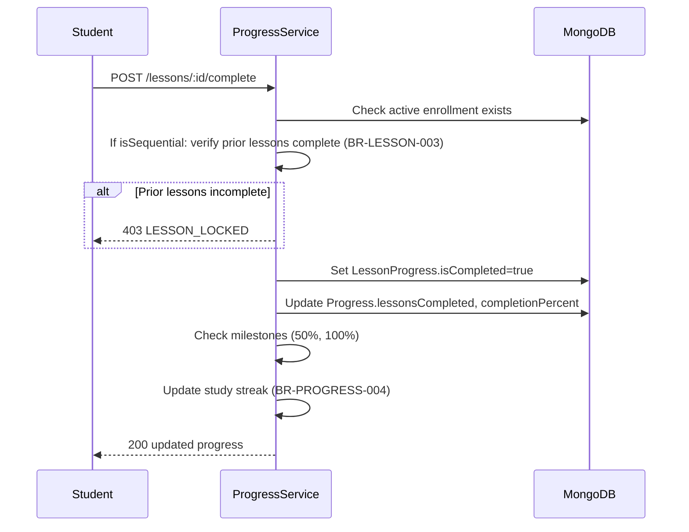

### 4.2 Enrollment Business Rules

| Rule ID | Name | Condition | Expected Result | Error |
|---------|------|-----------|-------------------|-------|
| BR-ENROLL-001 | No Duplicate Enrollment | Enroll | Unique student+course | "Already enrolled" |
| BR-ENROLL-002 | Published Course Only | Enroll | course.status=published | "Course not available" |
| BR-ENROLL-003 | Capacity Check | Enroll | active count < capacity | "Course is full" → waitlist |
| BR-ENROLL-004 | Active to Access Content | View lesson | enrollment.status=active | "Enrollment not active" |
| BR-ENROLL-005 | Cancel Preserves History | Cancel | status=cancelled, data kept | N/A |
| BR-ENROLL-006 | Expiration Job | Scheduled | expiresAt passed → status=expired | N/A |
| BR-ENROLL-007 | Progress Init on Enroll | Enroll success | Progress record created | N/A |

---

## 5. Quiz Grading Flow

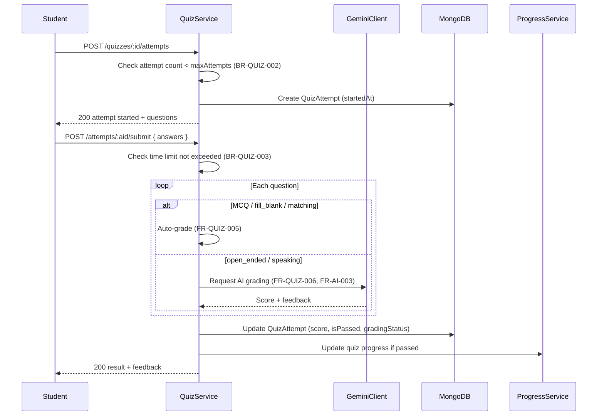

| Rule ID | Name | Condition | Expected Result |
|---------|------|-----------|-------------------|
| BR-QUIZ-001 | Enrolled to Attempt | Start quiz | Active enrollment required |
| BR-QUIZ-002 | Max Attempts | Start | attempts < maxAttempts |
| BR-QUIZ-003 | Time Limit | Submit | submittedAt - startedAt <= timeLimit |
| BR-QUIZ-004 | Passing Score | Grade | score >= passingScore → isPassed |
| BR-QUIZ-005 | Auto Grade Objectives | Submit | MCQ/fill/matching graded instantly |

---

## 6. Review Flow

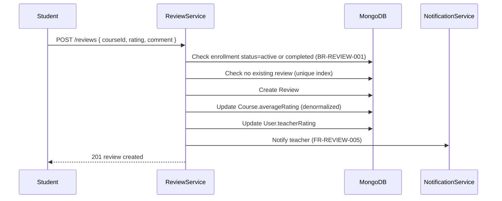

| Rule ID | Name | Condition | Expected Result |
|---------|------|-----------|-------------------|
| BR-REVIEW-001 | Enrolled to Review | Submit | enrollment exists (active/completed) |
| BR-REVIEW-002 | One Review Per Course | Submit | Unique student+course |
| BR-REVIEW-003 | Rating Range | Submit | 1 <= rating <= 5 |
| BR-REVIEW-004 | Admin Can Moderate | Flag/remove | isRemoved=true, hidden from catalog |

---

## 7. Certificate Flow

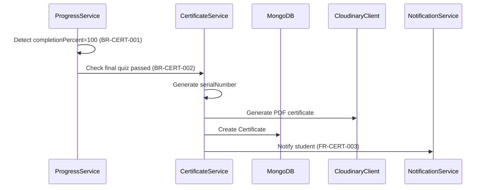

| Rule ID | Name | Condition | Expected Result |
|---------|------|-----------|-------------------|
| BR-CERT-001 | 100% Completion Required | Issue | completionPercent == 100 |
| BR-CERT-002 | Final Quiz Pass Required | Issue | Final quiz isPassed=true (if exists) |
| BR-CERT-003 | Unique Serial Number | Issue | serialNumber globally unique |
| BR-CERT-004 | Public Verification | GET by serial | Return valid/revoked status |
| BR-CERT-005 | Admin Can Revoke | Revoke | isRevoked=true with reason |

---

## 8. AI Assistant Flow

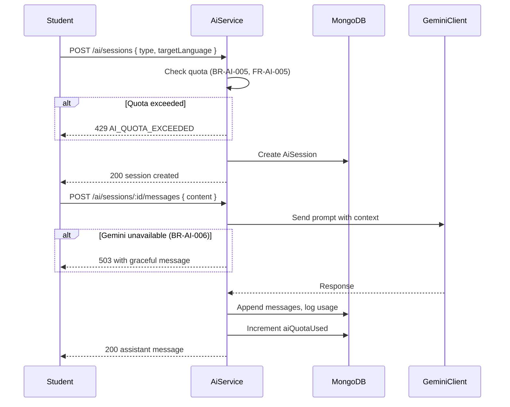

| Rule ID | Name | Condition | Expected Result |
|---------|------|-----------|-------------------|
| BR-AI-001 | Quota Per User | Each request | aiQuotaUsed < aiQuotaLimit |
| BR-AI-002 | Monthly Reset | Scheduled | Reset aiQuotaUsed monthly |
| BR-AI-003 | Log All Requests | Each request | AiUsageLog created |
| BR-AI-004 | Student Primary Consumer | Access | Student role for chat/grammar |
| BR-AI-005 | Teacher Assisted Grading | Quiz grade | Teacher can trigger AI grade |
| BR-AI-006 | Graceful Degradation | Gemini down | Return friendly error, no crash |

---

## 9. Notification Dispatch Flow

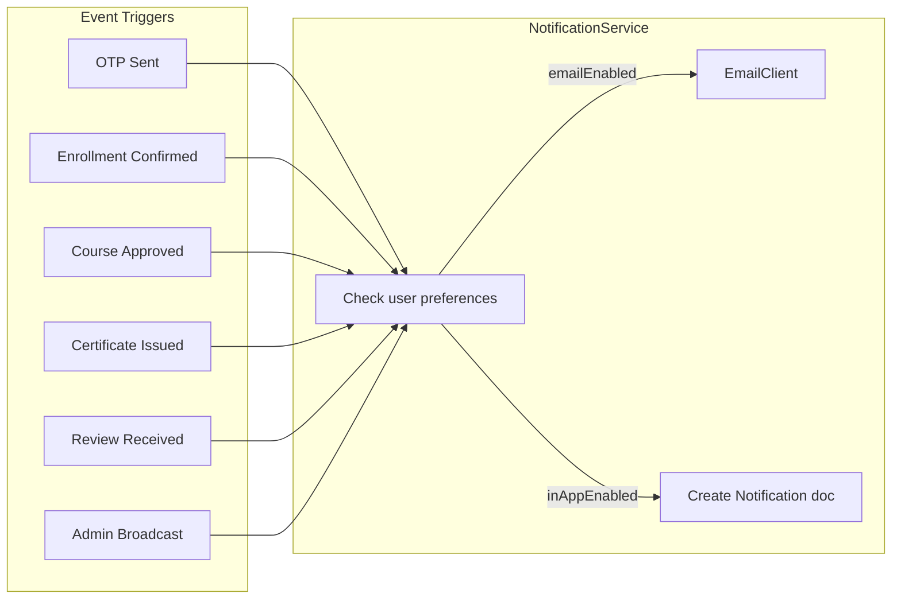

| Rule ID | Name | Condition | Expected Result |
|---------|------|-----------|-------------------|
| BR-NOTIF-001 | Respect Preferences | Dispatch | Skip disabled categories |
| BR-NOTIF-002 | Transactional Always On | OTP/reset | Cannot opt out of security emails |
| BR-NOTIF-003 | Retention Cleanup | Job monthly | Delete read notifications > 90 days |

---

## 10. Admin Governance Flow

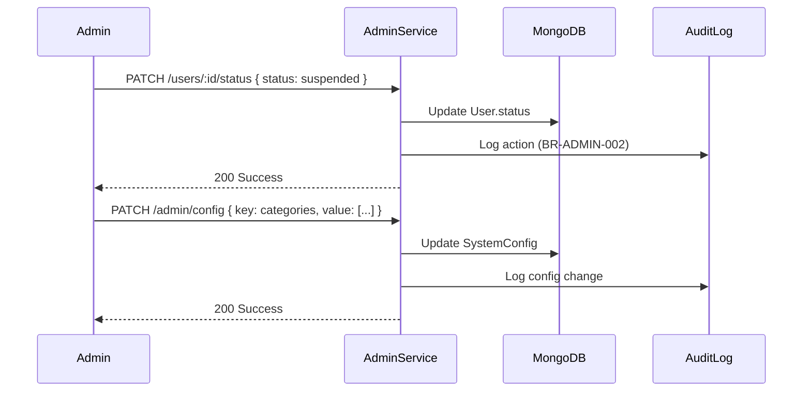

| Rule ID | Name | Condition | Expected Result |
|---------|------|-----------|-------------------|
| BR-ADMIN-001 | Admin Only Actions | All /admin routes | role==admin |
| BR-ADMIN-002 | Audit All Admin Actions | Any admin mutation | AuditLog entry created |
| BR-ADMIN-003 | Cannot Self-Suspend | Suspend user | actorId != targetId |
| BR-ADMIN-004 | Config Validation | Update config | Valid key from allowed list |

---

## 11. Media Upload Flow

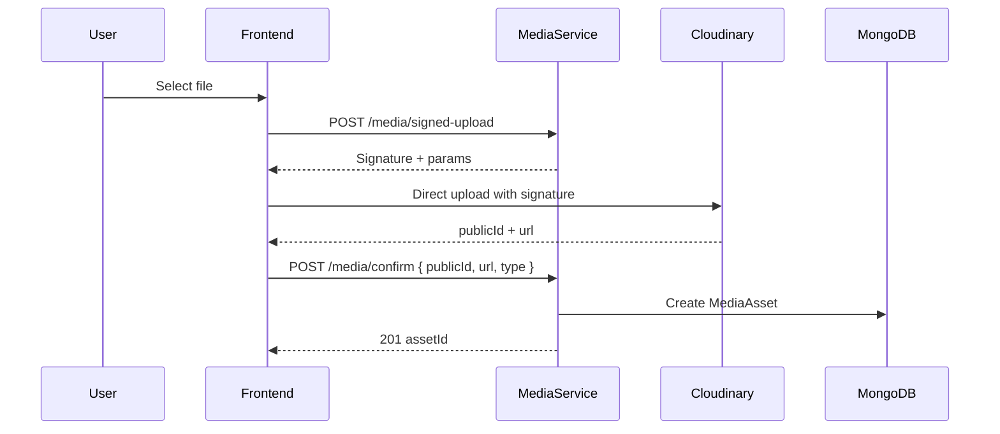

| Rule ID | Name | Condition | Expected Result |
|---------|------|-----------|-------------------|
| BR-MEDIA-001 | Signed Upload Only | Upload | Must use signed params |
| BR-MEDIA-002 | Owner Can Delete | Delete | ownerId == requester or Admin |
| BR-MEDIA-003 | Max File Size | Upload | Image 10MB, Video 500MB |
| BR-MEDIA-004 | Orphan Cleanup | Job weekly | Delete orphans > 7 days old |

---

## 12. Cross-Module Event Matrix

| Event | Triggered By | Notifications | Side Effects |
|-------|-------------|---------------|--------------|
| User registered | AuthService | OTP email | Create User |
| Email verified | AuthService | Welcome in-app | isEmailVerified=true |
| Teacher approved | AdminService | Email + in-app | role=teacher |
| Course submitted | CourseService | Admin in-app | status=pending_approval |
| Course published | CourseService | Teacher in-app | Visible in catalog |
| Student enrolled | EnrollmentService | Confirmation email | Create Progress |
| Lesson completed | ProgressService | — | Update %, streak |
| Quiz passed | QuizService | — | Update progress |
| Course 100% | ProgressService | — | Trigger certificate check |
| Certificate issued | CertificateService | Email + in-app | PDF on Cloudinary |
| Review submitted | ReviewService | Teacher in-app | Update ratings |
| Enrollment expired | Job | Email warning | status=expired, block access |
