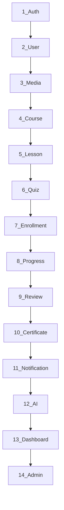

# 07 — Implementation Roadmap

## 1. Thứ tự triển khai (theo SDD §6)



**Nguyên tắc:** Mỗi bước hoàn thành backend (model → repository → service → controller → routes) + frontend (api → service → page) + seed data trước khi sang bước tiếp.

---

## 2. Chi tiết từng bước

### Step 1 — Authentication & Authorization

**Mục tiêu:** JWT infrastructure, RBAC middleware, auth UI.

**Backend tasks:**
- [ ] Tạo `models/User.js`, `RefreshToken.js`, `OtpToken.js`
- [ ] Tạo `repositories/`, `services/authService.js`
- [ ] Tạo `controllers/authController.js`, `routes/authRoutes.js`
- [ ] Tạo `middlewares/authMiddleware.js`, `roleGuard.js`, `errorHandler.js`
- [ ] Tạo `integrations/emailClient.js` (OTP emails)
- [ ] Tạo `integrations/googleOAuthClient.js`
- [ ] Tạo `exceptions/*`, `constants/roles.js`
- [ ] Implement BR-AUTH-001 through BR-AUTH-012

**Frontend tasks:**
- [ ] Cài Material UI (`@mui/material`, `@emotion/react`, `@emotion/styled`)
- [ ] Tạo `contexts/AuthContext.jsx`, `hooks/useAuth.js`
- [ ] Tạo `api/authApi.js`, `services/authService.js`
- [ ] Extend `api/axiosClient.js` — interceptors, refresh logic
- [ ] Tạo `pages/auth/*` (Login, Register, VerifyOtp, Forgot/Reset)
- [ ] Tạo `layouts/AuthLayout.jsx`
- [ ] Tạo `routes/ProtectedRoute.jsx`, `roleGuards.js`

**FR checklist:**

| FR | Priority | Status |
|----|----------|--------|
| FR-AUTH-001 Register | H | Pending |
| FR-AUTH-002 Send OTP | H | Pending |
| FR-AUTH-003 Verify OTP | H | Pending |
| FR-AUTH-004 Login | H | Pending |
| FR-AUTH-005 Google OAuth | H | Pending |
| FR-AUTH-006 Refresh Token | H | Pending |
| FR-AUTH-007 Logout | M | Pending |
| FR-AUTH-008 Forgot Password | H | Pending |
| FR-AUTH-009 Reset Password | H | Pending |
| FR-AUTH-010 RBAC | H | Pending |

**Exit criteria:** User có thể register → verify OTP → login → access protected route. Token refresh hoạt động.

---

### Step 2 — User Management

**Mục tiêu:** Profile CRUD, teacher application workflow.

**Backend tasks:**
- [ ] Tạo `models/TeacherApplication.js`
- [ ] Tạo `services/userService.js`, routes, controllers
- [ ] Implement BR-USER-001 through BR-USER-003

**Frontend tasks:**
- [ ] Tạo `pages/student/ProfilePage`, `TeacherApplicationPage`
- [ ] Tạo `api/userApi.js`, `services/userService.js`

**FR checklist:**

| FR | Priority | Status |
|----|----------|--------|
| FR-USER-001 View Profile | H | Pending |
| FR-USER-002 Update Profile | H | Pending |
| FR-USER-003 Submit Teacher Application | H | Pending |
| FR-USER-004 View Application Status | M | Pending |
| FR-USER-005 List Users (Admin) | M | Pending |
| FR-USER-006 Manage User Status | H | Pending |
| FR-USER-007 Change Role | M | Pending |

**Exit criteria:** Student cập nhật profile, submit teacher application. Admin approve → role đổi thành teacher.

---

### Step 3 — Media & File Storage

**Mục tiêu:** Cloudinary integration cho upload ảnh/video/PDF.

**Backend tasks:**
- [ ] Tạo `models/MediaAsset.js`
- [ ] Tạo `integrations/cloudinaryClient.js`
- [ ] Tạo `services/mediaService.js`, routes, controllers
- [ ] Tạo `middlewares/uploadMiddleware.js` (multer)
- [ ] Implement BR-MEDIA-001 through BR-MEDIA-004

**Frontend tasks:**
- [ ] Tạo `api/mediaApi.js`, `services/mediaService.js`
- [ ] Tạo upload component (drag-drop, progress bar)

**FR checklist:**

| FR | Priority | Status |
|----|----------|--------|
| FR-MEDIA-001 Upload | H | Pending |
| FR-MEDIA-002 Signed Upload | H | Pending |
| FR-MEDIA-003 Delete Asset | M | Pending |
| FR-MEDIA-004 Transform | M | Pending |
| FR-MEDIA-005 Orphan Cleanup | L | Pending |

**Exit criteria:** Teacher upload thumbnail qua signed upload flow; asset lưu trong MediaAsset.

---

### Step 4 — Course Management

**Mục tiêu:** Refactor Course hiện có → full lifecycle với approval.

**Backend tasks:**
- [ ] Extend `models/Course.js` — thêm slug, cefrLevel, category, status, capacity, ...
- [ ] Extract logic từ `controllers/course.js` → `services/courseService.js`
- [ ] Tạo `repositories/courseRepository.js`
- [ ] Thêm endpoints: submit, approve, reject, publish, archive
- [ ] Implement BR-COURSE-001 through BR-COURSE-009
- [ ] Migrate API prefix `/course/courses` → `/api/v1/courses`

**Frontend tasks:**
- [ ] Migrate `CourseList` → `CourseCatalogPage` + filters
- [ ] Migrate `Coursedetail` → `CourseDetailPage` (slug URL)
- [ ] Tạo `pages/teacher/CourseEditorPage`
- [ ] Tạo `components/course/CourseFilter.jsx`, `CourseForm.jsx`
- [ ] Wrap `courseApi` → `courseService`

**FR checklist:**

| FR | Priority | Status |
|----|----------|--------|
| FR-COURSE-001 Create | H | Partial (CRUD exists, no status) |
| FR-COURSE-002 Edit | H | Partial |
| FR-COURSE-003 Submit for Approval | H | Pending |
| FR-COURSE-004 Approve/Reject | H | Pending |
| FR-COURSE-005 Publish | H | Pending |
| FR-COURSE-006 Archive/Delete | M | Pending |
| FR-COURSE-007 Browse/Search | H | Partial (list only, no filter) |
| FR-COURSE-008 View Detail | H | Done (basic) |

**Exit criteria:** Teacher tạo draft → thêm lessons → submit → Admin approve → publish → hiện trên catalog.

---

### Step 5 — Lesson Management

**Mục tiêu:** Curriculum structure trong course.

**Backend tasks:**
- [ ] Tạo `models/Lesson.js`
- [ ] Tạo full stack: repository → service → controller → routes
- [ ] Implement reorder, sequential lock (BR-LESSON-003)
- [ ] Link media assets to lessons

**Frontend tasks:**
- [ ] Tạo `pages/teacher/LessonEditorPage`, `LessonManagementPage`
- [ ] Tạo `pages/student/LessonPlayerPage`
- [ ] Tạo `components/lesson/LessonPlayer.jsx`, `VocabularyList.jsx`

**FR checklist:**

| FR | Priority | Status |
|----|----------|--------|
| FR-LESSON-001 Create | H | Pending |
| FR-LESSON-002 Reorder | M | Pending |
| FR-LESSON-003 Upload Media | H | Pending |
| FR-LESSON-004 Edit Content | H | Pending |
| FR-LESSON-005 View Lesson | H | Pending |
| FR-LESSON-006 Mark Complete | H | Pending |
| FR-LESSON-007 Sequential Lock | M | Pending |

**Exit criteria:** Teacher tạo 3+ lessons; student (enrolled) xem lesson, mark complete.

---

### Step 6 — Quiz & Assessment

**Mục tiêu:** Quiz builder + student attempt + auto grading.

**Backend tasks:**
- [ ] Tạo `models/Quiz.js`, `Question.js`, `QuizAttempt.js`
- [ ] Tạo `services/quizService.js` — auto-grade logic
- [ ] Implement attempt limits, time limits, passing score

**Frontend tasks:**
- [ ] Tạo `pages/teacher/QuizBuilderPage`
- [ ] Tạo `pages/student/QuizAttemptPage`
- [ ] Tạo `components/quiz/QuizQuestion.jsx`, `QuizTimer.jsx`, `QuizResult.jsx`
- [ ] Tạo `hooks/useQuizTimer.js`

**FR checklist:**

| FR | Priority | Status |
|----|----------|--------|
| FR-QUIZ-001 Create Quiz | H | Pending |
| FR-QUIZ-002 Add Questions | H | Pending |
| FR-QUIZ-003 Start Attempt | H | Pending |
| FR-QUIZ-004 Submit Answers | H | Pending |
| FR-QUIZ-005 Auto-Grade | H | Pending |
| FR-QUIZ-006 AI Grading | M | Pending (Step 12) |
| FR-QUIZ-007 View Result | H | Pending |
| FR-QUIZ-008 Analytics | M | Pending |

**Exit criteria:** Teacher tạo quiz với MCQ; student làm bài, nhận điểm tự động.

---

### Step 7 — Enrollment Management

**Mục tiêu:** Refactor Enrollment hiện có → full status machine + auth.

**Backend tasks:**
- [ ] Extend `models/Enrollment.js` — status, expiresAt, paymentStatus
- [ ] Extract → `services/enrollmentService.js`
- [ ] Remove hardcoded studentId; dùng `req.user.id`
- [ ] Migrate `POST /enrollments/enroll` → `POST /enrollments`
- [ ] Migrate `GET /enrollments/student/:id` → `GET /enrollments/me`
- [ ] Implement waitlist, expiration job

**Frontend tasks:**
- [ ] Update `MyCoursesPage` — dùng AuthContext thay hardcode
- [ ] Update `CourseDetailPage` — enroll button với auth check
- [ ] Tạo `hooks/useEnrollment.js`

**FR checklist:**

| FR | Priority | Status |
|----|----------|--------|
| FR-ENROLL-001 Enroll | H | Partial (no auth, no status) |
| FR-ENROLL-002 Confirm Paid | H | Pending |
| FR-ENROLL-003 Cancel | M | Partial (unenroll exists) |
| FR-ENROLL-004 My Enrollments | H | Partial (hardcoded student) |
| FR-ENROLL-005 Waitlist | L | Pending |
| FR-ENROLL-006 Expire | M | Pending |

**Exit criteria:** Authenticated student enroll → enrollment active → xuất hiện trong My Courses.

---

### Step 8 — Learning Progress Tracking

**Mục tiêu:** Progress records, completion %, streaks.

**Backend tasks:**
- [ ] Tạo `models/Progress.js`, `LessonProgress.js`
- [ ] Auto-init progress on enrollment (hook in enrollmentService)
- [ ] Update progress on lesson complete + quiz pass
- [ ] Implement streak tracking job

**Frontend tasks:**
- [ ] Tạo `pages/student/ProgressPage`
- [ ] Progress bar component trong MyCourses + LessonPlayer

**FR checklist:**

| FR | Priority | Status |
|----|----------|--------|
| FR-PROGRESS-001 Init on Enroll | H | Pending |
| FR-PROGRESS-002 Update on Lesson | H | Pending |
| FR-PROGRESS-003 Completion % | H | Pending |
| FR-PROGRESS-004 Study Streak | M | Pending |
| FR-PROGRESS-005 View Report | M | Pending |

**Exit criteria:** Student thấy % hoàn thành cập nhật realtime khi mark lesson complete.

---

### Step 9 — Review & Rating

**Backend + Frontend tasks:**
- [ ] Tạo `models/Review.js`, full stack
- [ ] Review form trong `CourseDetailPage`
- [ ] Admin moderation page

**FR:** FR-REVIEW-001 (H), FR-REVIEW-002 (M), FR-REVIEW-003 (L), FR-REVIEW-004 (H)

---

### Step 10 — Certificate Management

**Backend + Frontend tasks:**
- [ ] Tạo `models/Certificate.js`, full stack
- [ ] PDF generation via Cloudinary/raw PDF lib
- [ ] Auto-trigger on 100% + quiz pass
- [ ] Public verification page
- [ ] Tạo `pages/student/CertificatesPage`

**FR:** FR-CERT-001 (H), FR-CERT-002 (H), FR-CERT-003 (H), FR-CERT-004 (M), FR-CERT-005 (M)

---

### Step 11 — Notification Management

**Backend + Frontend tasks:**
- [ ] Tạo `models/Notification.js`, `NotificationPreference.js`
- [ ] Tạo `services/notificationService.js` — wire all triggers
- [ ] Tạo `contexts/NotificationContext.jsx`
- [ ] Bell icon + feed page
- [ ] Wire transactional emails cho tất cả events đã build

**FR:** FR-NOTIF-001 (H), FR-NOTIF-002 (H), FR-NOTIF-003 (M), FR-NOTIF-004 (L), FR-NOTIF-005 (L), FR-NOTIF-006 (M)

---

### Step 12 — AI Learning Assistant

**Backend + Frontend tasks:**
- [ ] Tạo `integrations/geminiClient.js`
- [ ] Tạo `models/AiSession.js`, `AiUsageLog.js`
- [ ] Tạo `services/aiService.js` — quota enforcement
- [ ] Wire AI grading vào quizService (FR-QUIZ-006)
- [ ] Tạo `pages/student/AiAssistantPage`

**FR:** FR-AI-001 (M), FR-AI-002 (M), FR-AI-003 (M), FR-AI-004 (L), FR-AI-005 (M)

---

### Step 13 — Dashboard & Analytics

**Backend + Frontend tasks:**
- [ ] Tạo `services/dashboardService.js` — aggregation queries
- [ ] Tạo `jobs/refreshDashboardKpis.job.js`
- [ ] Tạo 3 dashboard pages (student, teacher, admin)
- [ ] Admin CSV export

**FR:** FR-DASH-001 (H), FR-DASH-002 (H), FR-DASH-003 (H), FR-DASH-004 (M)

---

### Step 14 — Admin & System Management

**Backend + Frontend tasks:**
- [ ] Tạo `models/SystemConfig.js`, `AuditLog.js`
- [ ] Tạo `services/adminService.js`
- [ ] Tạo tất cả `pages/admin/*`
- [ ] Tạo `layouts/AdminLayout.jsx`
- [ ] Consolidate: teacher approval, course approval, review moderation, config, audit

**FR:** FR-ADMIN-001 (H) through FR-ADMIN-006 (M)

**Exit criteria:** Admin có thể quản lý toàn bộ platform từ một dashboard thống nhất.

---

## 3. Reuse từ codebase hiện tại

| Asset hiện có | Cách reuse |
|---------------|------------|
| `Backend/src/models/Course.js` | Extend schema, không xóa |
| `Backend/src/models/Enrollment.js` | Extend schema, giữ unique index |
| `Backend/src/controllers/course.js` | Migrate logic → service, giữ API tạm |
| `Backend/src/controllers/enrollment.js` | Migrate logic → service |
| `learning_online/src/components/CourseCard.jsx` | Move + restyle với MUI |
| `learning_online/src/pages/MyCourses.jsx` | Move + add auth |
| `learning_online/src/api/axiosClient.js` | Extend, không rewrite |
| `courses.json` | Convert → `scripts/seedAll.js` |
| `Backend/seedCourses.js` | Merge vào seed script |

## 4. Seed Data Plan

```
scripts/seedAll.js
├── seedAdmin()        — 1 admin user
├── seedTeachers()     — 3 teachers (approved)
├── seedStudents()     — 5 students
├── seedCourses()      — 6 language courses (various levels)
├── seedLessons()      — 5 lessons per course
├── seedQuizzes()      — 1 quiz per course
├── seedEnrollments()  — students enrolled in 2-3 courses
├── seedReviews()      — sample reviews
└── seedSystemConfig() — categories, CEFR levels
```

## 5. Testing Strategy (khi implement)

| Level | Tool | Coverage |
|-------|------|----------|
| Unit | Jest | services, utils, validators |
| Integration | Jest + Supertest | API endpoints per module |
| E2E | Playwright/Cypress | Critical flows: register → enroll → complete lesson |

**Critical E2E flows:**
1. Register → OTP → Login → Browse → Enroll → View lesson → Complete → 100% → Certificate
2. Teacher: Create course → Add lessons → Submit → Admin approve → Publish
3. Admin: Approve teacher → Approve course → View dashboard KPIs

## 6. Timeline Estimate

| Step | Module | Estimate |
|------|--------|----------|
| 1 | Auth | 1.5 weeks |
| 2 | User | 0.5 week |
| 3 | Media | 0.5 week |
| 4 | Course | 1 week |
| 5 | Lesson | 1 week |
| 6 | Quiz | 1.5 weeks |
| 7 | Enrollment | 0.5 week |
| 8 | Progress | 0.5 week |
| 9 | Review | 0.5 week |
| 10 | Certificate | 0.5 week |
| 11 | Notification | 0.5 week |
| 12 | AI | 1 week |
| 13 | Dashboard | 1 week |
| 14 | Admin | 1 week |
| **Total** | | **~11 weeks** |

## 7. Definition of Done (toàn project)

- [ ] Tất cả FR priority **H** implemented và tested
- [ ] Tất cả FR priority **M** implemented
- [ ] RBAC enforced trên mọi protected endpoint
- [ ] Không còn hardcoded user IDs
- [ ] API versioned tại `/api/v1`
- [ ] Clean Architecture layers đầy đủ
- [ ] MUI theme applied consistently
- [ ] Seed script tạo demo data hoàn chỉnh
- [ ] README cập nhật hướng dẫn setup full-stack
